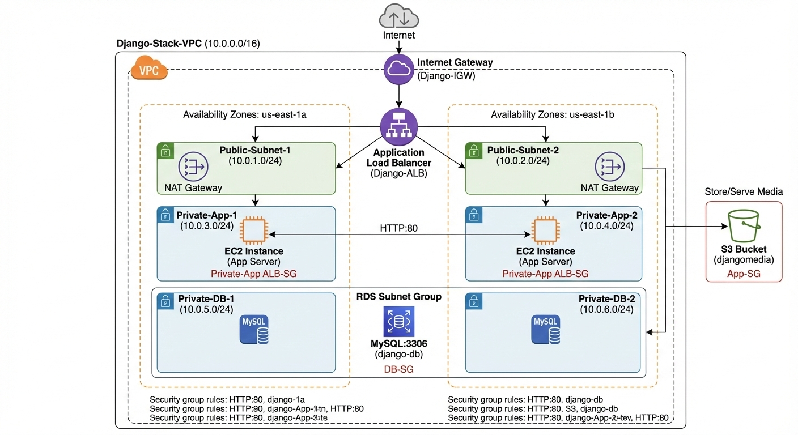

# AWS Lab: Building a Scalable 3-Tier Django Web Stack

## Project Objective
Deploy a professional-grade, secure, and scalable Django application. You will hide web servers in a private network, use an Application Load Balancer for traffic, store media in S3, and manage data in a private MySQL RDS instance.

## Architecture Diagram



---

## Architecture Overview
* **VPC:** Custom network with 6 subnets across 2 Availability Zones.
* **App Tier:** EC2 instances in private subnets running Dockerized Django.
* **Data Tier:** RDS MySQL in private data subnets.
* **Public Tier:** Application Load Balancer (ALB) and NAT Gateway.
* **Storage:** S3 Bucket for persistent media files.

---

## Phase 1: Networking & Connectivity (The Virtual Data Center)

### 1. Create the VPC
1.  Log in to the **AWS Management Console**.
2.  In the top search bar, type **VPC** and select the first service result.
3.  On the left-hand sidebar, click **Your VPCs**.
4.  Click the orange **Create VPC** button.
5.  Select **VPC only**.
    * **Name tag:** `Django-Stack-VPC`
    * **IPv4 CIDR:** `10.0.0.0/16`
6.  Scroll to the bottom and click **Create VPC**.

### 2. Create Subnets
1.  On the left-hand sidebar, click **Subnets**.
2.  Click **Create subnet**.
3.  **VPC ID:** Select `Django-Stack-VPC` from the dropdown.
4.  Create the following **6 subnets** one by one by clicking **Add new subnet** at the bottom of the page:

| Subnet Name | Availability Zone | CIDR Block | Purpose |
| :--- | :--- | :--- | :--- |
| `Public-Subnet-1` | us-east-1a | `10.0.1.0/24` | Public (ALB/NAT) |
| `Public-Subnet-2` | us-east-1b | `10.0.2.0/24` | Public (ALB) |
| `Private-App-1` | us-east-1a | `10.0.3.0/24` | Private (Django) |
| `Private-App-2` | us-east-1b | `10.0.4.0/24` | Private (Django) |
| `Private-DB-1` | us-east-1a | `10.0.5.0/24` | Private (MySQL) |
| `Private-DB-2` | us-east-1b | `10.0.6.0/24` | Private (MySQL) |

5.  Click **Create subnet**.

### 3. Configure Gateways (The Doors)
1.  **Internet Gateway (IGW):**
    * On the left sidebar, click **Internet Gateways**.
    * Click **Create internet gateway**. Name it `Django-IGW` and click **Create**.
    * Once created, click the **Actions** button (top right) and select **Attach to VPC**.
    * Select `Django-Stack-VPC` and click **Attach**.
2.  **NAT Gateway (Internet for Private Servers):**
    * On the left sidebar, click **NAT Gateways**.
    * Click **Create NAT gateway**.
    * **Name:** `Django-NAT`.
    * **Subnet:** Select `Public-Subnet-1`.
    * **Connectivity type:** Public.
    * Click **Allocate Elastic IP**.
    * Click **Create NAT gateway**. (Wait a moment for it to become "Available").

### 4. Configure Routing (The Roadmaps)
1.  On the left sidebar, click **Route Tables**.
2.  **Public Route Table:**
    * Click **Create route table**. Name it `Public-RT` and select `Django-Stack-VPC`.
    * Once created, select it. Go to the **Routes** tab > **Edit routes**.
    * Click **Add route**. Destination: `0.0.0.0/0` | Target: **Internet Gateway** > Select `Django-IGW`.
    * Click **Save changes**.
    * Go to **Subnet associations** tab > **Edit subnet associations**. Select `Public-Subnet-1` and `Public-Subnet-2`. Save.
3.  **Private Route Table:**
    * Click **Create route table**. Name it `Private-RT` and select `Django-Stack-VPC`.
    * Select it > **Routes** tab > **Edit routes**.
    * Click **Add route**. Destination: `0.0.0.0/0` | Target: **NAT Gateway** > Select `Django-NAT`.
    * Click **Save changes**.
    * Go to **Subnet associations** tab > **Edit subnet associations**. Select all 4 Private subnets (App-1, App-2, DB-1, DB-2). Save.

---

## Phase 2: Security Groups (The Firewalls)
*Navigation: Search for **EC2** > Left sidebar > **Security Groups**.*

1.  **ALB-SG (Entry Point):**
    * Click **Create security group**.
    * **Name:** `ALB-SG` | **VPC:** `Django-Stack-VPC`.
    * **Inbound Rules:** Add Rule > Type: `HTTP` | Port: `80` | Source: `Anywhere-IPv4` (`0.0.0.0/0`).
2.  **App-SG (Django Tier):**
    * Click **Create security group**.
    * **Name:** `App-SG` | **VPC:** `Django-Stack-VPC`.
    * **Inbound Rules:** Add Rule > Type: `HTTP` | Port: `80` | Source: **Custom** > Search/Select `ALB-SG`.
3.  **DB-SG (Database Tier):**
    * Click **Create security group**.
    * **Name:** `DB-SG` | **VPC:** `Django-Stack-VPC`.
    * **Inbound Rules:** Add Rule > Type: `MySQL/Aurora` | Port: `3306` | Source: **Custom** > Search/Select `App-SG`.

---

## Phase 3: Storage & Database

### 1. S3 Bucket (Media Files)
1.  Search for **S3** in the top bar.
2.  Click **Create bucket**.
3.  **Bucket name:** `djangomedia-[your-name-here]` (Must be unique globally).
4.  **Object Ownership:** Select **ACLs enabled**.
5.  **Block Public Access settings:** Uncheck **Block all public access**. (Check the box acknowledging this is risky—we need it for Django media).
6.  Click **Create bucket**.

### 2. RDS MySQL Database
1.  Search for **RDS** in the top bar.
2.  **Subnet Group (Crucial):** On the left sidebar, click **Subnet groups** > **Create DB subnet group**.
    * **Name:** `Django-DB-Group`.
    * **VPC:** `Django-Stack-VPC`.
    * **AZs:** Select `us-east-1a` and `us-east-1b`.
    * **Subnets:** Select Private-DB-1 and Private-DB-2. Click 
    * **Create**.
3.  **Create Database:**
    * Go to **Databases** on left sidebar > **Create database**.
    * **Method:** Standard create | **Engine:** MySQL.
    * **Templates:** **Free Tier**.
    * **Settings:** DB Instance ID: `django-db` | Master Username: `admin` | Password: `mauFJcuf5dhRMQrjj`.
    * **Connectivity:** VPC: `Django-Stack-VPC`. | DB Subnet Group: `Django-DB-Group`.
    * **Public access:** No.
    * **Security Group:** Choose existing > Select `DB-SG` (remove 'default').
    * **Additional configuration:** Under **Initial database name**, type `ecommerce`.
    * Click **Create database**. (Copy your **Endpoint** once it is created).

---

## Phase 4: Target Groups & Load Balancer

### 1. Target Group
1.  Search for **EC2** > Left sidebar > **Target Groups** (under Load Balancing).
2.  Click **Create target group**.
3.  **Target type:** Instances | **Name:** `Django-App-TG`.
4.  **Protocol:** HTTP | Port: 80 | VPC: `Django-Stack-VPC`.
5.  **Health checks:** Path: `/health/`.
6.  Click **Next** and then **Create target group** (we will add instances later).

### 2. Application Load Balancer (ALB)
1.  Left sidebar > **Load Balancers** > **Create load balancer**.
2.  Select **Application Load Balancer** > **Create**.
3.  **Name:** `Django-ALB`.
4.  **Network mapping:** VPC: `Django-Stack-VPC`.
    * **Mappings:** Check both `Public-Subnet-1` and `Public-Subnet-2`.
5.  **Security groups:** Select `ALB-SG`.
6.  **Listeners and routing:** Protocol: HTTP | Port: 80 | Default action: Forward to `Django-App-TG`.
7.  Click **Create load balancer**.

---

## Phase 5: Compute & Deployment

### 1. Launch EC2 Instances
1.  EC2 Dashboard > **Instances** > **Launch instances**.
2.  **Name:** `Django-Server`.
3.  **Quantity:** 2.
4.  **AMI:** Amazon Linux 2023.
5.  **Network Settings (Edit):**
    * **VPC:** `Django-Stack-VPC`.
    * **Subnet:** `Private-App-1` (AWS will balance across zones if possible, or you can launch 1 in App-1 and 1 in App-2 separately).
    * **Auto-assign public IP:** Disable.
    * **Security Groups:** Select `App-SG`.
6.  **Advanced Details:**
    * **IAM instance profile:** Select `LabProfileRole`.
    * **User data:** Paste the shell script below.
```bash
#!/bin/bash

# Redirect output to a log file so students can debug if it fails
# Log location: /var/log/user-data.log
exec > >(tee /var/log/user-data.log|logger -t user-data -s 2>/dev/console) 2>&1

echo "Starting Deployment Script..."

# 1. Update system and install base dependencies
dnf update -y
dnf install -y dnf-plugins-core git docker

# 2. Start and enable Docker service
systemctl enable --now docker

# 3. Add ec2-user to docker group
usermod -aG docker ec2-user

# 4. Install modern Docker Compose and Buildx plugins
dnf config-manager --add-repo https://download.docker.com/linux/fedora/docker-ce.repo
sed -i 's/\$releasever/40/g' /etc/yum.repos.d/docker-ce.repo

dnf download -y docker-compose-plugin docker-buildx-plugin
rpm -ivh --force docker-compose-plugin*.rpm docker-buildx-plugin*.rpm
rm -f docker-compose-plugin*.rpm docker-buildx-plugin*.rpm

# 5. WAIT for Docker to be fully active
# This prevents "Cannot connect to the Docker daemon" errors
while ! docker info >/dev/null 2>&1; do 
  echo "Waiting for Docker daemon..."
  sleep 2
done

# 6. Clone the repository into a specific directory
mkdir -p /home/ec2-user/app
cd /home/ec2-user/app
git clone https://github.com/tekraj/Cloud-Computing-PGS.git .

# 7. Setup environment variables
cat <<EOF > .env
SECRET_KEY=dsafdsafdsafdsa
DEBUG=True
# Update the DB_HOST with your RDS endpoint
DB_HOST=database-1.c4harpvynqqh.us-east-1.rds.amazonaws.com
DB_NAME=ecommerce
DB_USER=admin
DB_PORT=3306
DB_PASSWORD=mauFJcuf5dhRMQrjj
ALLOWED_HOSTS=*
# put server number 1 or 2 based on the instance
SERVER_NUMBER=[server number]
# Update with your S3 bucket name
AWS_STORAGE_BUCKET_NAME=djangomedia[studentname]
EOF

# 8. FIX PERMISSIONS BEFORE RUNNING DOCKER
# Ensure ec2-user owns everything
chown -R ec2-user:ec2-user /home/ec2-user/app

# 9. RUN DOCKER AS ROOT (Since User Data runs as root)
# We don't need to wait for a logout/login this way
docker compose build
docker compose up -d

echo "Deployment Complete!"

```
    * **IMPORTANT:** Inside the script, replace `DB_HOST` with your RDS Endpoint and `AWS_STORAGE_BUCKET_NAME` with your S3 name.
7.  Click **Launch instance**.

### 2. Register Instances to Target Group
1.  Go to **Target Groups** > Select `Django-App-TG`.
2.  Click the **Targets** tab > **Register targets**.
3.  Select your two Django instances > **Include as pending below** > **Register targets**.

---

## Phase 6: Testing
1.  Go to **Load Balancers** > Select `Django-ALB`.
2.  Copy the **DNS name** (e.g., `django-alb-12345.us-east-1.elb.amazonaws.com`).
3.  Paste it into your web browser. 
4.  If the page loads, your traffic is successfully traveling: **Internet -> ALB -> Private EC2 -> Private RDS!**